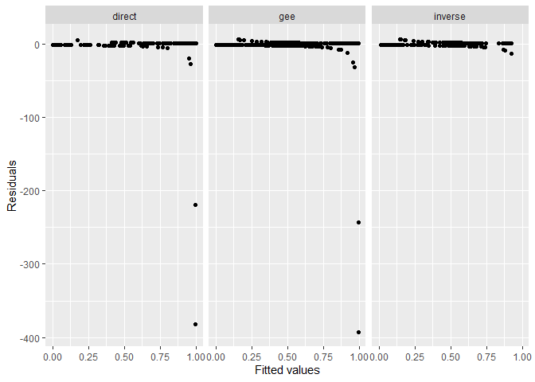

<!-- README.md is generated from README.Rmd. Please edit that file -->

# Modana

<!-- badges: start -->

[](https://github.com/gvegayon/Modana/actions/workflows/R-CMD-check.yaml)
<!-- badges: end -->

The goal of the `Modana` package is to implement a refinement of
moderation analysis with binary outcomes, as proposed by [Anto and Su
(2023)](https://journals.sagepub.com/doi/abs/10.1177/09622802231151206?journalCode=smma).
The function fits three models of interest: a direct model, an inverse
model, and a generalized estimating equation (GEE) model. The direct and
inverse models are fitted using the `glm` function to verify the
symmetry property of odds ratio/relative risk in moderation analysis for
the main treatment effect as well as the moderating effects. The GEE
model is fitted using the `geeglm` function and is used to estimate the
treatment effect accounting for within-cluster correlation. The `Modana`
package has three different built functions.

## Installation

You can install the development version of Modana like so:

``` r
devtools::install_github("Quamena/Modana")
```

## Example

This is a basic example which shows you how to solve a common problem:

``` r
library(Modana)
## basic example code
```

You can simulate some data to run moderation analysis

``` r
set.seed(1099)
b0 <- c(1, 1.2, 1, 1.5, -2, -.5, 1.2, 1.5)
a0 <- c(-1, 1.5, -1, 1.5)
#a0 <- c(-2, 2, 2, 0, 1)
b0 <- c(-1.5, 1.5, 1.5, -2, 2, -.5, -1, 1.5)
 datt <- sim_data(n = 100, b0, a0 = NULL, binary.Xs = FALSE,
                      sigma = 1, uniform = FALSE, c0 = 1,
                      link.function = "logistic", rho = 0.2,
                      observational = FALSE, trt.p = 0.5,
                      interaction = 1:2, details = FALSE)
#> There are a total of 4 covariates
head(datt)
#>   y trt         x1         x2         x3         x4
#> 1 0   0 -1.0272485  1.5804971 -0.1492128  0.2379859
#> 2 1   0 -2.3314105 -1.6163845  1.9313538  1.8053311
#> 3 0   1  0.4191473 -0.7286691 -0.5131350  1.8232865
#> 4 0   0 -1.8775643  1.0827282  1.3265782 -1.1509396
#> 5 1   0  0.5414926 -0.1900738  0.4512489  0.4825833
#> 6 1   0 -0.6896955  0.6951233  1.9000859 -0.3240436
```

The `refinedmod()` function implements refined moderation analysis to
estimate both main treatment effect and moderating effects associated
with two logistic regression models with binary outcomes/treatment via
generalized estimating equations (GEE). The function first performs a
role swap algorithm on the original data to obtain a clustered data of
size `2` (i.e., swapping the roles of the response variable and
treatment variable columns in the original data data and then stacking
the resultant data on top of the original data).

``` r
getres <- refinedmod(formula = y ~ trt + x1 + x2 + x3 + x4,
                     detail = TRUE, y = "y",
                    trt = "trt", data = datt,
                     effmod = c("x1", "x2"),
                      corstr = "independence")
#> The direct modeling fitting: 
#> =================================================================
#> 
#> Call:
#> glm(formula = form.direct, family = binomial(link = "logit"), 
#>     data = .SD)
#> 
#> Deviance Residuals: 
#>      Min        1Q    Median        3Q       Max  
#> -2.12526  -0.54951  -0.08492   0.53698   2.68620  
#> 
#> Coefficients:
#>             Estimate Std. Error z value Pr(>|z|)    
#> (Intercept)  -2.1411     0.6469  -3.310 0.000934 ***
#> trt           1.9063     0.7249   2.630 0.008545 ** 
#> x1            1.6592     0.6746   2.459 0.013921 *  
#> x2           -2.3898     0.6830  -3.499 0.000467 ***
#> x3            2.4399     0.5453   4.474 7.67e-06 ***
#> x4           -0.3810     0.2994  -1.273 0.203182    
#> trt:x1       -1.6094     0.7477  -2.153 0.031357 *  
#> trt:x2        1.4938     0.7740   1.930 0.053598 .  
#> ---
#> Signif. codes:  0 '***' 0.001 '**' 0.01 '*' 0.05 '.' 0.1 ' ' 1
#> 
#> (Dispersion parameter for binomial family taken to be 1)
#> 
#>     Null deviance: 136.058  on 99  degrees of freedom
#> Residual deviance:  71.649  on 92  degrees of freedom
#> AIC: 87.649
#> 
#> Number of Fisher Scoring iterations: 6
#> 
#> The inverse modeling fitting: 
#> =================================================================
#> 
#> Call:
#> glm(formula = form.inverse, family = binomial(link = "logit"), 
#>     data = .SD)
#> 
#> Deviance Residuals: 
#>     Min       1Q   Median       3Q      Max  
#> -1.8781  -0.9950   0.4503   1.0532   1.8161  
#> 
#> Coefficients:
#>             Estimate Std. Error z value Pr(>|z|)  
#> (Intercept)  -0.3216     0.3075  -1.046   0.2957  
#> y             1.6005     0.6344   2.523   0.0116 *
#> x1            0.1812     0.2571   0.705   0.4810  
#> x2           -0.2929     0.3610  -0.811   0.4172  
#> x3           -0.2798     0.3029  -0.924   0.3556  
#> x4            0.4367     0.2297   1.901   0.0573 .
#> y:x1         -0.6432     0.4373  -1.471   0.1414  
#> y:x2          1.2298     0.5382   2.285   0.0223 *
#> ---
#> Signif. codes:  0 '***' 0.001 '**' 0.01 '*' 0.05 '.' 0.1 ' ' 1
#> 
#> (Dispersion parameter for binomial family taken to be 1)
#> 
#>     Null deviance: 138.27  on 99  degrees of freedom
#> Residual deviance: 120.78  on 92  degrees of freedom
#> AIC: 136.78
#> 
#> Number of Fisher Scoring iterations: 4
#> 
#> The GEE modeling fitting: 
#> =================================================================
#>               Estimate Std. Error   z value     Pr(>|z|)
#> (Intercept) -1.9882558  0.6313724 -3.149102 1.637732e-03
#> trt          1.7420214  0.6742747  2.583548 9.778975e-03
#> x1           1.1263252  0.3902621  2.886073 3.900812e-03
#> x2          -2.1327750  0.4347750 -4.905468 9.320477e-07
#> x3           2.2584618  0.4912020  4.597827 4.269210e-06
#> x4          -0.4006063  0.2991221 -1.339273 1.804817e-01
#> z            1.6338187  0.5822168  2.806203 5.012902e-03
#> x1:z        -0.8611383  0.3730072 -2.308637 2.096371e-02
#> x2:z         1.8597407  0.4994187  3.723811 1.962380e-04
#> x3:z        -2.5671182  0.6832798 -3.757053 1.719264e-04
#> x4:z         0.8363693  0.3954295  2.115091 3.442221e-02
#> trt:x1      -0.9294065  0.4424454 -2.100613 3.567497e-02
#> trt:x2       1.2861794  0.5361274  2.399018 1.643911e-02
#names(getres)
summary(getres, 4)
#> Model summary of the direct, inverse and inverse estimation:
#> $out.direct
#>              Estimate Std. Error   z value     Pr(>|z|)
#> (Intercept) -2.141103  0.6469410 -3.309579 9.343624e-04
#> trt          1.906338  0.7249114  2.629753 8.544700e-03
#> x1           1.659156  0.6746465  2.459296 1.392097e-02
#> x2          -2.389839  0.6830095 -3.498984 4.670340e-04
#> x3           2.439921  0.5453335  4.474182 7.670454e-06
#> x4          -0.381040  0.2994330 -1.272538 2.031819e-01
#> trt:x1      -1.609422  0.7476922 -2.152519 3.135650e-02
#> trt:x2       1.493800  0.7739598  1.930075 5.359757e-02
#> 
#> $out.inverse
#>               Estimate Std. Error    z value   Pr(>|z|)
#> (Intercept) -0.3215810  0.3075437 -1.0456432 0.29572582
#> y            1.6005048  0.6343528  2.5230515 0.01163414
#> x1           0.1812059  0.2571344  0.7047126 0.48098911
#> x2          -0.2928971  0.3610304 -0.8112808 0.41720442
#> x3          -0.2797805  0.3028536 -0.9238145 0.35558289
#> x4           0.4367291  0.2297411  1.9009620 0.05730699
#> y:x1        -0.6431931  0.4373363 -1.4707059 0.14137067
#> y:x2         1.2297949  0.5382257  2.2849058 0.02231835
#> 
#> $out.gee
#>               Estimate Std. Error   z value     Pr(>|z|)
#> (Intercept) -1.9882558  0.6313724 -3.149102 1.637732e-03
#> trt          1.7420214  0.6742747  2.583548 9.778975e-03
#> x1           1.1263252  0.3902621  2.886073 3.900812e-03
#> x2          -2.1327750  0.4347750 -4.905468 9.320477e-07
#> x3           2.2584618  0.4912020  4.597827 4.269210e-06
#> x4          -0.4006063  0.2991221 -1.339273 1.804817e-01
#> z            1.6338187  0.5822168  2.806203 5.012902e-03
#> x1:z        -0.8611383  0.3730072 -2.308637 2.096371e-02
#> x2:z         1.8597407  0.4994187  3.723811 1.962380e-04
#> x3:z        -2.5671182  0.6832798 -3.757053 1.719264e-04
#> x4:z         0.8363693  0.3954295  2.115091 3.442221e-02
#> trt:x1      -0.9294065  0.4424454 -2.100613 3.567497e-02
#> trt:x2       1.2861794  0.5361274  2.399018 1.643911e-02
```

You can call each elements of listed models

Mostly importantly, we can print the results of the refined estimation.

``` r
print(getres)
#>               Estimate Std. Error   z value     Pr(>|z|)
#> (Intercept) -1.9882558  0.6313724 -3.149102 1.637732e-03
#> trt          1.7420214  0.6742747  2.583548 9.778975e-03
#> x1           1.1263252  0.3902621  2.886073 3.900812e-03
#> x2          -2.1327750  0.4347750 -4.905468 9.320477e-07
#> x3           2.2584618  0.4912020  4.597827 4.269210e-06
#> x4          -0.4006063  0.2991221 -1.339273 1.804817e-01
#> z            1.6338187  0.5822168  2.806203 5.012902e-03
#> x1:z        -0.8611383  0.3730072 -2.308637 2.096371e-02
#> x2:z         1.8597407  0.4994187  3.723811 1.962380e-04
#> x3:z        -2.5671182  0.6832798 -3.757053 1.719264e-04
#> x4:z         0.8363693  0.3954295  2.115091 3.442221e-02
#> trt:x1      -0.9294065  0.4424454 -2.100613 3.567497e-02
#> trt:x2       1.2861794  0.5361274  2.399018 1.643911e-02
```

Example usage on a real-world data

``` r
data(Warts, package = "Modana")
dat <- Warts
#data wrangling
dat$type <- ifelse(dat$type == 3, 1, 0)
```

``` r
res <- refinedmod(formula = response ~ cryo + age + time + type,
                     detail = FALSE, y = "response",
                    trt = "cryo", data = dat,
                     effmod = c("age", "type"),
                      corstr = "independence")

summary(res, 4)
#> Model summary of the direct, inverse and inverse estimation:
#> $out.direct
#>                Estimate Std. Error    z value     Pr(>|z|)
#> (Intercept)  7.43389234 1.44174216  5.1561871 2.520291e-07
#> cryo         0.59583647 1.31994245  0.4514109 6.516934e-01
#> age         -0.03101099 0.02544718 -1.2186414 2.229803e-01
#> time        -0.58626540 0.11036007 -5.3122965 1.082523e-07
#> type        -0.54809045 0.87790128 -0.6243190 5.324181e-01
#> cryo:age    -0.05274381 0.04052874 -1.3013930 1.931240e-01
#> cryo:type   -2.84915648 1.43163124 -1.9901469 4.657476e-02
#> 
#> $out.inverse
#>                   Estimate Std. Error   z value    Pr(>|z|)
#> (Intercept)    1.330124634 1.12688939  1.180351 0.237860775
#> response       1.122502722 1.10380267  1.016941 0.309181269
#> age           -0.007120097 0.02312125 -0.307946 0.758123388
#> time          -0.091230920 0.06679007 -1.365935 0.171959267
#> type           1.878541061 0.70810373  2.652918 0.007979928
#> response:age  -0.071976045 0.03263765 -2.205307 0.027432563
#> response:type -3.632251469 0.95771302 -3.792630 0.000149060
#> 
#> $out.gee
#>                Estimate Std. Error    z value     Pr(>|z|)
#> (Intercept)  7.42036779 2.12457045  3.4926438 4.782640e-04
#> cryo         0.94854255 1.09332337  0.8675773 3.856258e-01
#> age         -0.02664027 0.02350883 -1.1332029 2.571291e-01
#> time        -0.60056451 0.16830032 -3.5684098 3.591544e-04
#> type        -0.35357228 0.91818191 -0.3850787 7.001791e-01
#> z           -6.07463142 1.39817721 -4.3446792 1.394794e-05
#> age:z        0.01717663 0.02031301  0.8455974 3.977774e-01
#> time:z       0.51570766 0.13299353  3.8776897 1.054531e-04
#> type:z       2.13458124 0.65420080  3.2628839 1.102847e-03
#> cryo:age    -0.06485767 0.03032095 -2.1390378 3.243260e-02
#> cryo:type   -3.40781554 0.91201807 -3.7365658 1.865506e-04
```

``` r
plot(res)
```



``` r
confint(res, model = 3)
#>                    Coef         lwr         upr
#> (Intercept)  7.42036779  3.92576038 10.91497521
#> cryo         0.94854255 -0.84981436  2.74689947
#> age         -0.02664027 -0.06530886  0.01202831
#> time        -0.60056451 -0.87739390 -0.32373512
#> type        -0.35357228 -1.86384713  1.15670257
#> z           -6.07463142 -8.37442828 -3.77483455
#> age:z        0.01717663 -0.01623530  0.05058855
#> time:z       0.51570766  0.29695276  0.73446256
#> type:z       2.13458124  1.05851668  3.21064580
#> cryo:age    -0.06485767 -0.11473120 -0.01498414
#> cryo:type   -3.40781554 -4.90795177 -1.90767930
```
